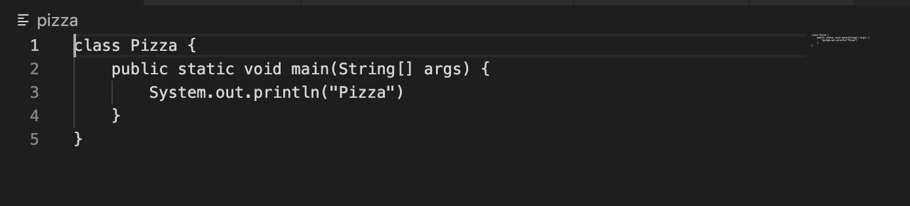
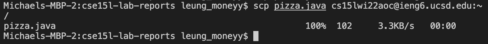
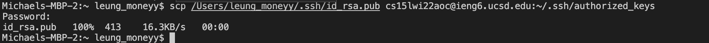

**How to install vscode**

First, open up the visual studio code website with the this [link](https://code.visualstudio.com/).
Next, click the download button and download the version for your specific device (mac or windows).
After downloading, opening vscode should show this 

**How to connect to course specific account on ieng6**

If on windows, first install [OpenSSH](https://docs.microsoft.com/en-us/windows-server/administration/openssh/openssh_install_firstuse) by following the instructions on the link provided. Next, create a new terminal on visual studio code  and type out this code on the terminal to connect to your student account 

instead of aoc, put the specific letters that correspond to your student account

After connecting, it will ask you for a password. Enter your password for your student account and the terminal should look like this after logging in. (when putting in your password you can't see what you type in but once you type all of it and press enter, assuming you have no typos it will log you in)  
You are now logged in!

**Trying some commands**

Try using ls on both your local computer and the student account terminal and see what happens.  

As you can see, ls is different for your local computer and the student account terminal. This is because after you have ssh-ed you have logged into the ieng6 server for your student account which won't have all the files and content as your local computer. Other commands such as cd, mkdir, and pwd will have different results in your local terminal and the ssh terminal, because even though you are on the same laptop or computer after ssh-ing all the commands you put in the terminal before logging out all are processed in the ssh terminal. Feel free to try it out for yourself!

**Moving Files with scp**

Even though after logging into your student - specific account all the commands in the terminal correspond to that account, there are ways to move files from your local device to the student account.

First, create a file with any contents you want. Here as an example I have a file named pizza that simply prints out the word pizza when run on the terminal . To copy this file to the remote account use the scp command as seen here: 

After entering the scp with your file name and student account, it should prompt you for your password. After ssh-ing, you should be able to see your file when inputting the command ls. 

**SSH keys**

Inputting in your password every time you try to log into the ieng6 server is tedious but there is a way so you don't have to input your password every time. 

First, type into your local terminal ssh-keygen. 

Next, it will prompt you for a file in which to save the key, where you can re-input what they give you in parenthesis. 

It will ask you for a passphrase where you can just push enter to not have a passphrase to make it easier to log in. 

Log into your ssh account and create a new directory called .ssh by inputting mkdir .ssh

Logout and copy the key into your account by inputting this command to your local terminal. 

Enter in your password one more time. From now on when you ssh into your student account, it will no longer prompt you for a password!

**Optimizing Remote Running**

Instead of inputting separate commands when you want to scp a file onto your remote account, it can all be done in one line. By putting a parenthesis on the command you want to input in the ssh server, it will log out after being done with that command. Also, multiple commands can be used on the same line in the terminal by separating commands with a semicolon. Combining these two steps together, a file can be copied and run on the ssh server very efficiently. This is demonstrated using the pizza file again: 

The scp command first copies the  pizza file into the student account. Then following the semicolon, the ssh command logs us into the student account and running the commands within the parenthesis and promptly logging out. As you can see, Pizza is printed out as a result. 

