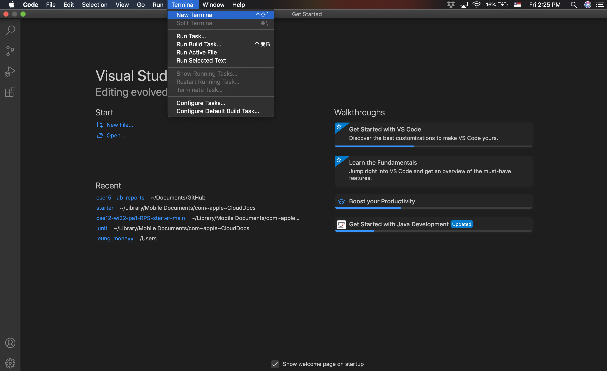
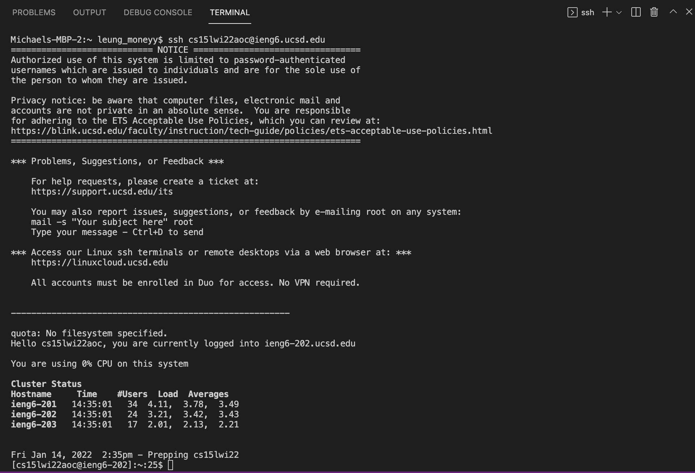
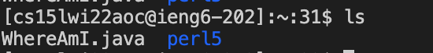
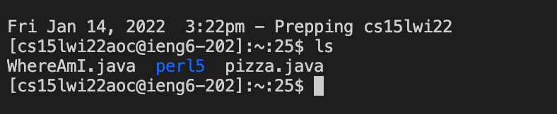
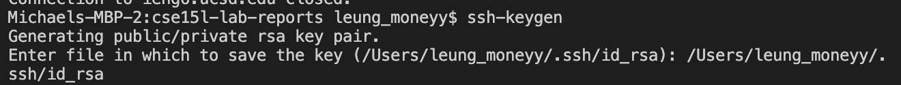
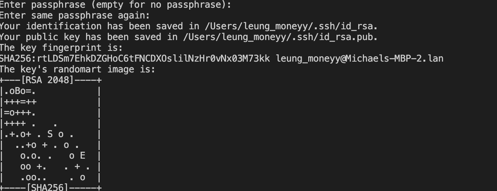
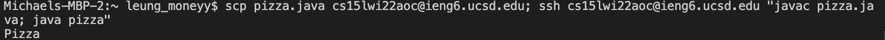

# How to install vscode

First, open up the visual studio code website with the this [link](https://code.visualstudio.com/).
Next, click the download button and download the version for your specific device (mac or windows).
After downloading, opening vscode should show this 

# How to connect to course specific account on ieng6

If on windows, first install [OpenSSH](https://docs.microsoft.com/en-us/windows-server/administration/openssh/openssh_install_firstuse) by following the instructions on the link provided. Next, create a new terminal on visual studio code  and type out this code on the terminal to connect to your student account `ssh cse15lwi22aoc@ieng6.ucsd.edu`

instead of aoc, put the specific letters that correspond to your student account

After connecting, it will ask you for a password. Enter your password for your student account and the terminal should look like this after logging in.  
You are now logged in!

# Trying some commands

Try using ls on both your local computer and the student account terminal and see what happens.  

As you can see, ls is different for your local computer and the student account terminal. This is because after you have ssh-ed you have logged into the ieng6 server for your student account which won't have all the files and content as your local computer. 

Other commands are `cd`, `mkdir`, `pwd`, and `cp`. Some of these commands will have different outputs in your ssh terminal. Feel free to try it out for yourself!

# Moving Files with scp

Even though after logging into your student - specific account all the commands in the terminal correspond to that account, there are ways to move files from your local device to the student account.

First, create a file with any contents you want. Here as an example I have a file named pizza that simply prints out the word pizza when run on the terminal
```
class pizza {
    public static void main(String[] args) {
        System.out.println("Pizza");
    }
}
```

 To copy this file to the remote account use this scp command as seen here: 

`scp pizza.java cs15lwi22aoc@ieng6.ucsd.edu`

After entering the scp with your file name and student account, it should prompt you for your password. After ssh-ing, you should be able to see your file when inputting the command ls. 

# SSH keys

Inputting in your password every time you try to log into the ieng6 server is tedious but there is a way so you don't have to input your password every time. 

First, type into your local terminal ssh-keygen. 

Next, it will prompt you for a file in which to save the key, where you can re-input what they give you in parenthesis. 



So here, my file name is `/Users/leung_moneyy/.ssh/id_rsa`

It will ask you for a passphrase where you can just push enter to not have a passphrase to make it easier to log in. 



Log into your ssh account and create a new directory called .ssh by inputting into the ssh terminal
`mkdir .ssh`

Logout and copy the key into your account by inputting this command to your local terminal. 

`scp /Users/leung_moneyy/.ssh.id_rsa.pub cs15lwi22aoc@ieng6.ucsd.edu:~/.ssh/authorized_keys`

Enter in your password one more time. From now on when you ssh into your student account, it will no longer prompt you for a password!

# Optimizing Remote Running

To save time, you can run multiple commands on the same line in the terminal. To separate the commands within the terminal, use the key `;`.You can also tell the terminal the commands you want to put in the ssh terminal using `" command you want to run on ssh terminal "`. 
Here's an example
`scp pizza.java cs15lwi22aoc@ieng6.ucsd.edu; ssh cs15lwi22aoc@ieng6.ucsd.edu "javac pizza.java; java pizza"`


The scp command first copies the  pizza file into the student account. Then following the semicolon, the ssh command logs us into the student account and runs the commands within the parenthesis and then promptly logging out. As you can see, Pizza is printed out as a result, and this compile and run was executed in the ssh server!



This is a very effective way of being able make changes to your local terminal and the ssh terminal at the same time and on the same line. 


