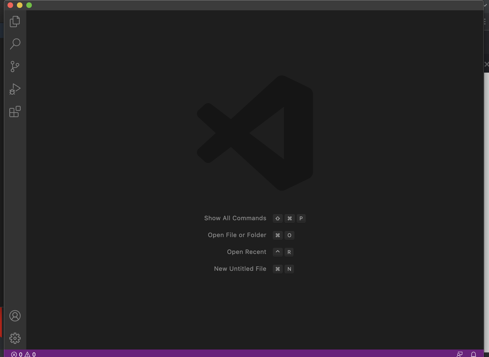

**How to install vscode**

First, open up the visual studio code website with the this [link](https://code.visualstudio.com/).
Next, click the download button and download the version for your specific device (mac or windows).
After downloading, opening vscode should show this 

**How to connect to course specific account on ieng6**

If on windows, first install [OpenSSH](https://docs.microsoft.com/en-us/windows-server/administration/openssh/openssh_install_firstuse) by following the instructions on the link provided. Next, create a new terminal on visual studio code  and type out this code on the terminal to connect to your student account 

instead of aoc, put the specific letters that correspond to your student account

After connecting, it will ask you for a password. Enter your password for your student account and the terminal should look like this after logging in. (when putting in your password you can't see what you type in but once you type all of it and press enter, assuming you have no typos it will log you in)  
You are now logged in!

**Trying some commands**

Try using ls on both your local computer and the student account terminal and see what happens.  

As you can see, ls is different for your local computer and the student account terminal. This is because after you have ssh-ed you have logged into the ieng6 server for your student account which won't have all the files and content as your local computer. Other commands such as cd, mkdir, and pwd will have different results in your local terminal and the ssh terminal, because even though you are on the same laptop or computer after ssh-ing all the commands you put in the terminal before logging out all are processed in the ssh terminal. Feel free to try it out for yourself!

**Moving Files with scp**

Even though after logging into your student - specific account all the commands in the terminal correspond to that account, there are ways to move files from your local device to the student account. 