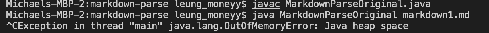
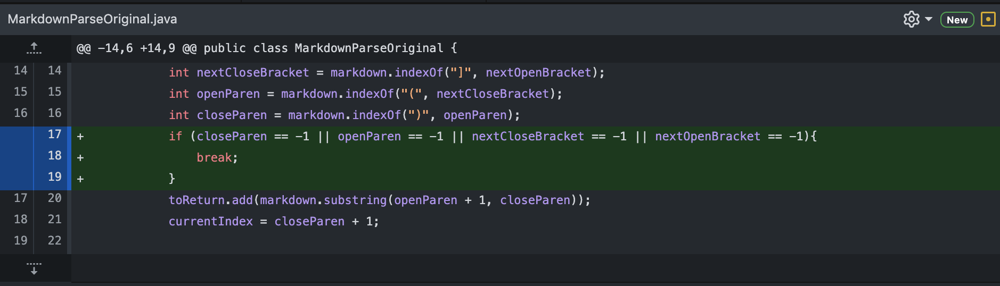
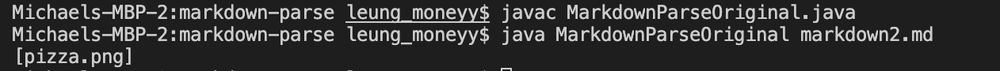
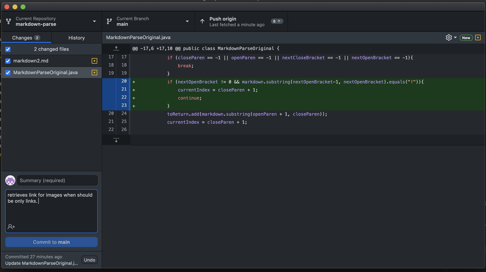

# First bug in week 3, out of memory error
Our first bug in week three lab appeared when trying to run [this](https://michaeleung.github.io/cse15l-lab-reports/markdown1.html) test file, with two links and characters after the two links. There were no bugs during compile time, but in run time the symptom was an OutofMemoryError correlating with heap space. 

In order to fix this, our group decided that the while loop needed to break when no more parenthesis or brackets could be found by indexOf. 

Here, the failure inducing input caused a bug and a symptom to be seen because characters were placed after the links. The bug, a faulty while loop unable to break after no links are find, and the symptom, an OutofMemoryError are tightly intertwined. This is because the symptom of OutofMemoryError is a direct result of an infinite while loop. 

# Second bug in week 3, avoiding an image when finding links

Another bug our group encountered when debugging the original MarkdownParse code was what to do when an image is within the markdown file. As seen in the test [file](https://michaeleung.github.io/cse15l-lab-reports/markdown2.html) , the markdown file contains an image. As our code is now, the getLinks method will retrieve this image as a file, which we don't want, as seen here: 

In order to fix this, we added a piece of code that will `continue` in the while loop if there is a `!` before the open bracket. 

From the file of an image, there were no compile time errors or runtime errors, however there was still a bug and symptom within the system. The bug was that the code was unable to separate image and links within the markdown files, and the symptom was printing out the image when nothing should be printed within the file. So here, the bug of not being able to separate link and images caused the symptom. 

# third bug in week 4, failure when running MarkdownParseTest when it should succeed

A bug that our group encountered when designing the MarkdownParseTest, was that one of our assertEquals was giving a failure, even though that specific failure was not caused by the MarkdownParse class. The test failure was found in an empty markdown [file](https://michaeleung.github.io/cse15l-lab-reports/markdown4.html), and produced this failure message: 

[image](emptymd.png)

Both of them show an empty list, so we deducted it must be something within our MarkdownParseTest code. Finally, we saw in the list used in our assertEquals to compare the expected outputs to the outputs produced by getLinks, we had accidently added an empty string to the third array list element. 

[image](githubchanges.png)

Here, the test file allowed us to determine that there was a bug within our MarkdownParseTest code because our MarkdownParse had correctly printed out an empty array before. The bug here was that our code appended an empty string to the list that was being compared to the getLinks output and the symptom is that there is a failure within the test run when there should not be. The bug and symptom are related because the bug of adding an empty string produced a symptom of showing failures when running the MarkdownParseTest. 

