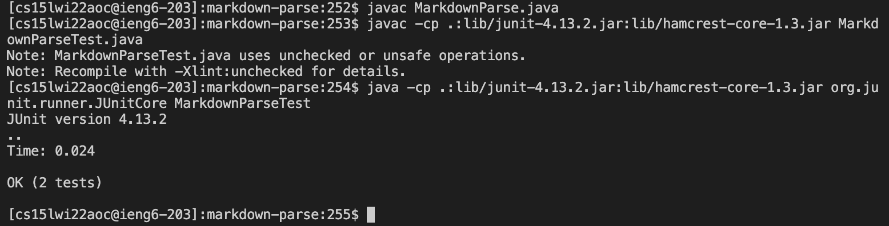
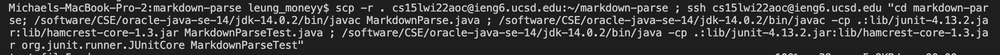
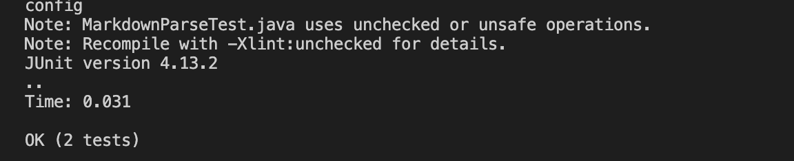

# Copying whole directories with scp -r

Here, I will demonstrate copying a whole directory with scp -r using the markdown-parse directory. In my markdown-parse directory, here are the files that I want to copy: 

To copy all the files within this directory into the ssh student directory or another remote server I will have to use the command 
`scp -r . cs15lwi22aoc@ieng6.ucsd.edu:~/markdown-parse` 
where `-r` means to copy recursively all the files within the directory, and `.` is the current directory. Where `cs15lwi22aoc@ieng6.ucsd.edu` is, you can put the remote server you want to copy the directory to, and `markdown-parse` is the directory you want to copy. 

After doing the scp -r command, I logged into the remote student server to check if the markdown-parse directory was in there. 

As you can see, the markdown-parse directory is in the ssh server, and all the files that were within the markdown-parse directory is also remained the same. 

I can also run the tests within the MarkdownParseTest.java file, even in the ssh server. 

Here within my MarkdownParseTest.java file I test these 4 files:

[markdown1.md](https://michaeleung.github.io/cse15l-lab-reports/markdown1.html)
[markdown2.md](https://michaeleung.github.io/cse15l-lab-reports/markdown2.html)
[markdown3.md](https://michaeleung.github.io/cse15l-lab-reports/markdown3.html)
[markdown4.md](https://michaeleung.github.io/cse15l-lab-reports/markdown4.html)

First, I have to compile the MarkdownParse.java file because now we are at a different terminal using the command `javac MarkdownParse.java`

Then, I have to compile the MarkdownParseTest.java file with the hamcrest and junit file like this: `javac -cp .:lib/junit-4.13.2.jar:lib/hamcrest-core-1.3.jar MarkdownParseTest.java`

After compiling, you can run the tester file, and because loading the files is already within the tester file I don't have to specify all the files I want to load within the command line: `java -cp .:lib/junit-4.13.2.jar:lib/hamcrest-core-1.3.jar org.junit.runner.JUnitCore MarkdownParseTest`

Overall, the process should look like this:

In fact, we can actually do all this in one line! By copying the directory to the ssh server, and then running it on the server it saves a lot of time.

In order to do all the commands in one step it would look something like this:

`scp -r . cs15lwi22aoc@ieng6.ucsd.edu:~/markdown-parse ; ssh cs15lwi22aoc@ieng6.ucsd.edu "cd markdown-parse; /software/CSE/oracle-java-se-14/jdk-14.0.2/bin/javac MarkdownParse.java ; /software/CSE/oracle-java-se-14/jdk-14.0.2/bin/javac -cp .:lib/junit-4.13.2.jar:lib/hamcrest-core-1.3.jar MarkdownParseTest.java ; /software/CSE/oracle-java-se-14/jdk-14.0.2/bin/java -cp .:lib/junit-4.13.2.jar:lib/hamcrest-core-1.3.jar org.junit.runner.JUnitCore MarkdownParseTest` 

The reason why `/software/CSE/oracle-java-se-14/jdk-14.0.2/bin/java` (or javac instead of the java at the end) is used is because the jdk within the ssh terminal is in a different version. 

The whole process should look like this, showing that tests passed in the end and sending you back to your main terminal. 

However, if you wanted to copy a certain amount of files to the ssh server or a remote server, you can modify the  `scp -r` command to be more precise. 
Using the command  `scp -r *.java *.md lib/ cs15lwi22aoc@ieng6.ucsd.edu`, I can limit the files I want to copy to only the ones that are java files, md files, and the files under the lib folder. 

Here are all the files that are copied into the server you want to move the directory and only certain files to. 

