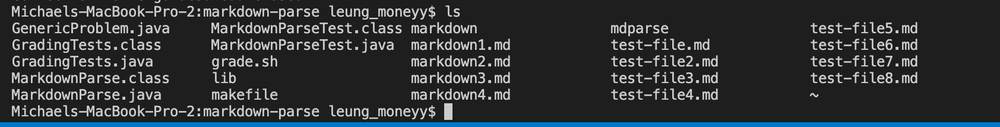
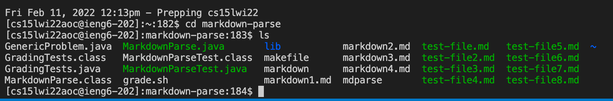
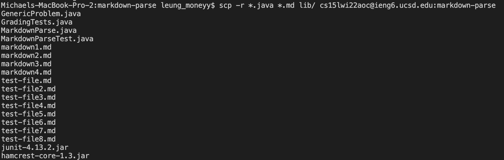

# Copying whole directories with scp -r

Here, I will demonstrate copying a whole directory with scp -r using the markdown-parse directory. In my markdown-parse directory, here are the files that I want to copy: 

To copy all the files within this directory into the ssh student directory or another remote server I will have to use the command 
`scp -r . cs15lwi22aoc@ieng6.ucsd.edu:~/markdown-parse` 
where `-r` means to copy recursively all the files within the directory, and `.` is the current directory. Where `cs15lwi22aoc@ieng6.ucsd.edu` is, you can put the remote server you want to copy the directory to, and `markdown-parse` is the directory you want to copy. 

After doing the scp -r command, I logged into the remote student server to check if the markdown-parse directory was in there. 

As you can see, the markdown-parse directory is in the ssh server, and all the files that were within the markdown-parse directory is also remained the same. 

However, if you wanted to copy a certain amount of files to the ssh server or a remote server, you can modify the  `scp -r` command to be more precise. 
Using the command  `scp -r *.java *.md lib/ cs15lwi22aoc@ieng6.ucsd.edu`, I can limit the files I want to copy to only the ones that are java files, md files, and the files under the lib folder. 

Here are all the files that are copied into the server you want to move the directory and only certain files to. 

