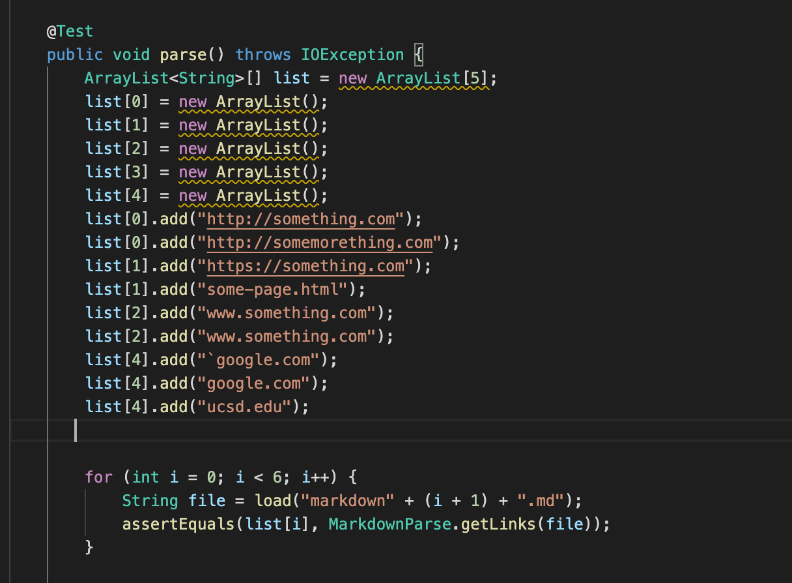

My own markdown-parse [repository](https://github.com/michaeLeung/markdown-parse)
Reviewed [repository](https://github.com/tylercyang/markdown-parse)

My Own implementation, the 3 tests:
Since in order to test my MarkdownParseTest.java I used a for loop to test all the markdown files, I tested the 3 markdown files with a for loop.
Snippet 1:

this test failed producing this output

Snippet 2:

this test failed producing this output

Snippet 3:

this test failed producing this output

For the reviewed code I added the 3 new tests as separate tester methods following the format of the tester class already

as a result, all three 3 test cases that I implemented in the tester file failed: 

Analysis:

For the first snippet, I don't believe that there is code to implement <10 lines in order to count the backticks and have the program understand that it is not a link. This is because if the backticks are within the brackets it will count as a link or if the backticks start in the link but end outside the link it will also be a link. Backticks just seem to have a lot of situational conditions on whether or not it will affect a link or not and I don't believe that can be done in fewer than 10 lines of code. 

For the second snippet, I believe that the block cannot be fixed for it and related cases because a stack would probably have to be implemented in order to count when an open paranthesis is used within the link to make sure you get the right closing paranthesis to close it. Also, if there is a bracket or parenthesis within the title it is hard to differentiate when to end the title because the next ending bracket may not be the one next to open paranthesis, or there may be multiple ending brackets next to open parentheses. 

For the third snippet, I believe that the block of text can be parsed and related texts can also be parsed correctly because there seems to be only 2 problems, spaces before and after the links and a link without a closing paranthesis. This can probably be fixed by making an if statement that will not add the links into the array storing the links if there is not a closing parenthesis found before an opening bracket. To fix the spaces we can do an if statement to only start registering the link after there are no more spaces after an opening parenthesis, and stopping after spaces because a link should not have spaces typically. 
