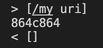

Two different outputs that I found when comparing the markdownparse that my lab group made and the markdownparse that was shown in week 9's lab were in the files 488.md which contained: `[link](</my uri>)` (no backticks, just to make sure md doesn't register that as a file) and and 577.md which contained: `` within the test-files/ 

I first converted the results of running the my own markdownparse and the markdownparse provided in the lab by using `bash script.sh > results.txt`. 

Within my script.sh file, I had this code: 
```
for file in test-files/*.md;
do
  echo $file
  java MarkdownParse $file
done
```

And then, I was able to compare the results of both MarkdownParse classes by using the `diff` function. Or more specifically, `diff markdown-parse/results.txt cse15l-markdown-parse/results.txt`


From this, I chose to compare these two differences within the code: 



where the first result is from my own markdown-parse and the second one is the one provided in the lab. 

488.md:
for finding the links within 488.md, the expected result should be `[</my uri>]` because there seems to be nothing stopping from the link from being valid, such as codeblocks or missing brackets or links. As a result, I believe that my own markdownparse is valid for this md file, however the lab's markdownparse code is not valid. I believe the bug is somewhere within the findCloseParen function, shown here: 


Where findCloseParen function is used to find the close parenthesis within the main getLinks method. This seems to be incorrect specifically around the `while` loop because there is no parenthesis within the initial opening and closing parenthesis, and hence within the code close parenthesis keeps incrementing until it reaches the length of the markdown file, resulting in -1 and no links found. 

577.md:
for finding the links within 577.md, the expected result should be `[]` because there is an image within the file, not necessarily a link. As a result, I believe that my own markdownparse is valid for this md file, and the lab's markdownparse code is not valid. I believe the bug is within the main getLinks() method here:

where there should be a conditional statement checking if there is a `!` before `[` and to not add that link within the array as a result. 
